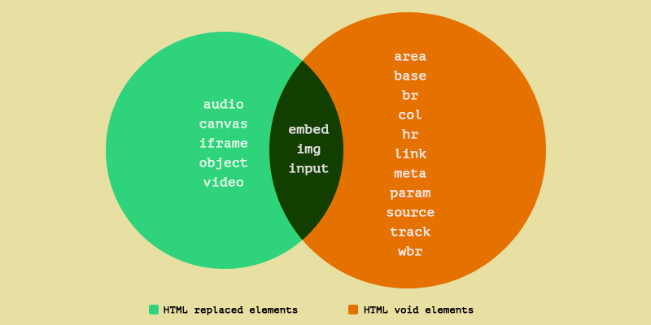
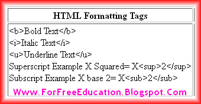

[1] Are the HTML tags and elements the same thing?
ANS: html tags is starting tags and between spaCE IS ELEMENT elements tags is ending tags.
EXAMPLES: [BASIC TAGS]
IN THIS EXAMPLE`<B>`IS THE STARTING TAG AND `</B>` IS THE ENDING TAG BUT WITH CONTENT INSIDE IT.
`<B>` THIS IS THE CONTENT.`</B>`
[2] • What are tags and attributes in HTML?
ANS: HTML attributes are the opening tags and used to define the characters of an html elements. the html attributes contain two parts attribute name(=) operator ,attribute valve (" ") double quotes.
EXAMPLE: THIS IS EXAMPLE SHOW THE BASIC USE OF HTML ATTRIBUTES.
[3] • What are void elements in HTML? With Example.
ANS: a void element cannot have any content but may have attributes. void element are self-closing ,so they must not have a closing TAGS.
EXAMPLE:`<BR>,<META>, <LINK>,<IFRAME>,,<INPUT>`.


[4] • What are HTML Entities? With Example
ANS: the html entities are used toi display reserved characters that are used in html code ,special character,and and invisible character .  
EXAMPLE:

`<p>`This is a `&lt;`p`&gt;` tag.`</p>`
< -LESS THAN, > GREATER THAN, ; SEMICOLON.
  
(5) • What are different types of lists in HTML? With Example.
ANS: an unordered list start with the `<ul>` tag. Each list item starts with the `<li>` tag. an ordered list with the `<ol>,<dl>,<dt>, <dd>`.
EXAMPLE : UNORDERED LIST

```html
<ul>
  <li>coffee</li>
  <li>tea</li>
  <li>milk</li>
</ul>
```

EXAMPLE WITH ORDERED:

```html
<ol>
  <li>pav bhaji</li>
  <li>pizza</li>
  <li>chips</li>
</ol>
```

[6] • What is the ‘class’ attribute in HTML? With Example
ANS: the html class attribute is used to specify one or more class names for an element . commonly, the class attribute points to a class in a style sheet .the name is case sensitive.
Example of the HTML class attribute:

```html
<!DOCTYPE html>
<html>
  <head>
    <title>Title of the document</title>
    <style>
      .red {
        color: red;
      }
      .orange {
        color: orange;
      }
    </style>
  </head>
  <body>
    <h1>Example of the HTML class attribute</h1>
    <p class="red">It is a some red paragraph.</p>
    <p>This is a some text.</p>
    <p class="orange">It is a some yellow paragraph.</p>
  </body>
</html>
```

[7] What is the difference between the ‘id’ attribute and the ‘class’ attribute of HTML elements? With Example.
ANS: the only difference between them is that "id" is unique in a page and can only apply to at most one element ,while "class"selector can apply to multiple element.
WITH EXAMPLE:

```html
<!DOCTYPE html>
<html>
	<head>
		<style>

				color: blue;
			}
		</style>
	</head>
	<body>
		<h1 id=Html Tutorials</h1>
		<h2>This is a paragraph.</h2>
		<h3>This is a paragraph.</h3>
	</body>
</html>
```

[8] • What are the various formatting tags in HTML?
ANS: In this article, we will discuss different formatting tags in HTML.(like – bold, italic, or emphasized, etc.).
EXAMPLE:
IN THIS EXAMPLE ,WE WILL USE `<B>`AND`<STRONG>`

[9] • How is Cell Padding different from Cell Spacing? With Example.
ANS: It is created by using html `<table>` tag but type attribute is set to cellpadding. cellspacing can get subject to more than one cell.
EXAMPLE:

```html
<table cellpadding="VALUE">
  .....
</table>
<table cellspacing="VALUE">
  .....
</table>
```

[10] • How can we club two or more rows or columns into a single row or column in an HTML table? With Example.
ANS:HTML provides two table attributes “rowspan” and “colspan” to make a cell span to multiple rows and columns respectively.
EXAMPLE: COLSPAN=FOR USING MULTI -COLUMN HEADINGS.
COLSPAN= FOR USING SINGLE-ROW TITLE.
ROWSPAN= CODE EXAMPLE.
[11] • What is the difference between a block-level element and an inline element?
ANS: BLOCK element takes up the full width available ,and has a line break before and letter it . and INLINE element takes up only as much width as necessary , and does not force link breaks after it.
EXAMPLE:

BLOCK element = inline element
`• <p>           = •<a>`
`• <h1>           = •<b>`
`• <ul>           = •<i>`
`• <hr>           = •`

[12] • How to create a Hyperlink in HTML? With Example.
ANS: We can create a hyperlink in HTML using a standard anchor tag.
EXAMPLE:`<a href="/files/logo.png" download="Programiz">Download Image</a>`

[13] • What is the use of an iframe tag? With Example.
ANS:The iframe HTML tag is used to specify the URL of the document to be embedded. Iframes are often used to embed videos, maps, and other media used.

EXAMPLE:https://th.bing.com/th?id=OVP.X49qETXodUt4fi8D7hvv_gHgFo&w=243&h=136&c=7&rs=1&qlt=90&o=5&dpr=1.3&pid=2.1

[14] • What is the use of a span tag? Explain with example?
ANS:The HTML tag defines a generic inline container in an HTML document.
EXAMPLE : A <span> element which is used to color a part of a text:

<p>My teddy has <span style="color:violet">violet</span> hands.`</p>`

[15] • How to insert a picture into a background image of a web page? With Example`.
ANS: BACK GROUND IMAGES HELP WEB SITE MAKE THEM ATTRACTIVE TO USERS.
...
EXAMPLE :

[16] • How are active links different from normal links?
ANS: LINKS ARE CATEGORIZE INTO THREE TYEP. TYPEiCALLY A LINK IS DISPLAYED IN THREE DIFFERENT. LINKS ARE ESTABLISHED IN SIMPLE HTML TAGS
• Normal links (Unvisited links)
• Visited links
• Active links

```HTML
EXAMPLE:

<!DOCTYPE html>
<html>

<body>
    <h2>This is a Link</h2>
    <h1>
        Welcome to
        <a href ="HTTPS://WWW.PRIME MINISTER JAN DHAN YOJANA .ORG/">
        </a>
    </h1>
</body>

</html>
```

[17] • What are the different tags to separate sections of text?

ANS:THE SEPARATER A SECTION FROM ANOTHER SECTION IN HTML. SYNTAX SECTION TAG IS USED TO DISTRIBUTE CONTENT.

[18]• What is SVG?
ANS: SVG IS "SCALABLE VECTOR GRAPHICS.

[19] • What is difference between HTML and XHTML?

ANS: HTML IS BROWSER TREND TO IGNORE ERRORS IN HTML PAGES AND DISPLAY THE WEB SITE EVEN IF THERE ARE MARK UP ERROR.AND XHTML WITH STRICTER ERROR HANDING IT REQUIRES PROPER PROPER NESTING ,CLOSING OF ELEMENT.

[20]• What are logical and physical tags in HTML?

ANS:

PHYSICAL TAGS:
•`<BR>`
•`<BOLD>`
•`<I>`
•`<STRIKE>`
•`<U>`
•`<LARGE>`

LOGICAL TAGS:
•`<B>`
•`<H1>...<H6>`
•`<ADDRESS>`

[21] • Create below example using only HTML tags without CSS.
